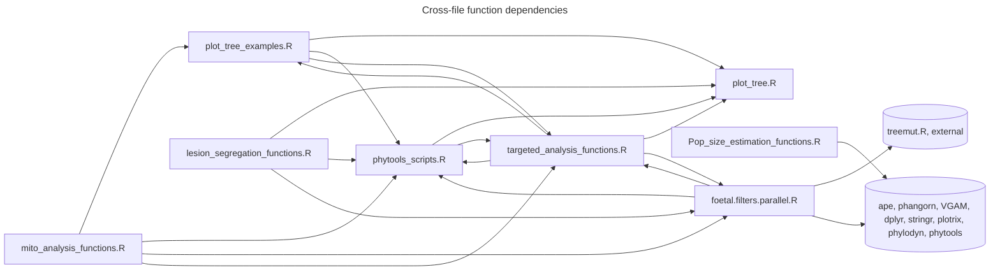
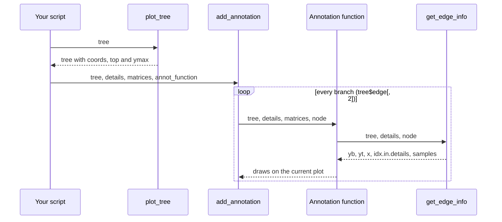
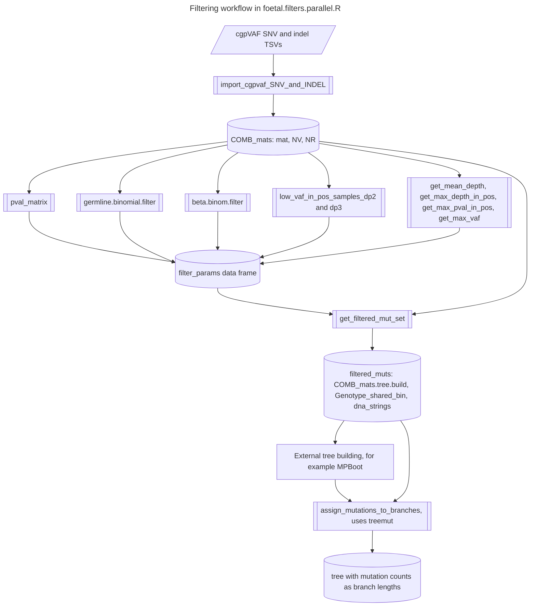

# external_my_functions: R functions for somatic-mutation phylogenetics

A collection of R functions for building, annotating and plotting phylogenetic trees of somatic mutations from whole-genome sequenced colonies, and for overlaying targeted (bulk) sequencing on those trees. The files are plain R scripts that are loaded with `source()`; this is not an R package.

It is a fork of the upstream repository `mspencerchapman/my_functions`, with no changes to the code in this fork. Its main consumer here is the companion repository [external_mouse_phylo](https://github.com/medmaca/external_mouse_phylo), whose notebooks and scripts source every file in this folder.

> [!important] Read the known issues before relying on a function
> Several functions depend on global variables, some fail under current R versions, and 13 function names are defined in more than one file, so the version you get depends on the order in which files are sourced. See [Known issues and caveats](#Known%20issues%20and%20caveats) and [Duplicated function names](#Duplicated%20function%20names). Where an issue concerns the intent of a function, confirm it with the code's author before changing it.

## Contents at a glance

Authorship is taken from the git history, using GitHub account names. All files are by `mspencerchapman`; comments in some files note that individual functions were adapted from colleagues' code.

| File | Functions | Theme | Used by external_mouse_phylo | Loads packages when sourced |
| --- | --- | --- | --- | --- |
| `plot_tree.R` | 14 | core tree layout and drawing (`plot_tree`) and tree navigation | yes | none |
| `plot_tree_examples.R` | 32 | annotation layer for `plot_tree`: branch colouring, labels, VAF bars, tip points | yes | `RColorBrewer`, `dichromat` |
| `phytools_scripts.R` | 14 | node heights, tips, mutation burden, sensitivity correction, AMOVA | yes | none |
| `Pop_size_estimation_functions.R` | 6 | ultrametric trees and population-size plots | yes (`make.ultrametric.tree`) | `devtools`, `ape`, `MCMCglmm`, `phangorn`, `spam` |
| `targeted_analysis_functions.R` | 32 | targeted-sequencing validation, cell fractions, lineage loss, binomial mixture models | yes | none |
| `foetal.filters.parallel.R` | 29 | cgpVAF import, mutation filtering, genotype matrices, mutation assignment | yes (`import_cgpvaf_SNV_and_INDEL`) | `VGAM` |
| `foetal.filters.R` | 11 | older version of the filtering functions, with different signatures | overrides the newer versions in the notebooks | `VGAM` |
| `lesion_segregation_functions.R` | 44 | persistent DNA lesion analysis (PVVs and MAVs), phasing, copy number, tree statistics | no | none |
| `mito_analysis_functions.R` | 7 | mitochondrial mutation matrices, plots and spectra | no | none |
| `README.md`, `README_obsidian.md` | | this document (GitHub and Obsidian versions) | | |

## Folder tree

```text
external_my_functions/
├── README.md                          this document (GitHub version)
├── README_obsidian.md                 the same document for an Obsidian vault
├── plot_tree.R                        tree layout, drawing and navigation
├── plot_tree_examples.R               annotation functions for plot_tree output
├── phytools_scripts.R                 tree metrics, burden, AMOVA
├── Pop_size_estimation_functions.R    ultrametric trees, BNPR plots
├── targeted_analysis_functions.R      targeted sequencing on trees, mixture models
├── foetal.filters.parallel.R          mutation filtering (current version)
├── foetal.filters.R                   mutation filtering (older version)
├── lesion_segregation_functions.R     lesion segregation, phasing, copy number
└── mito_analysis_functions.R          mitochondrial mutation analysis
```

## How the files fit together

The files call each other's functions freely, so most of them only work once the others have been sourced.



### The plotting pattern

Most plotting functions follow one pattern. `plot_tree` draws the tree and returns it with layout coordinates attached; `add_annotation` then calls an annotation function once per branch, and that function uses `get_edge_info` to find where the branch was drawn.



An annotation function must accept `(tree, details, matrices, node, ...)` in that order. `add_annotation_targeted` is a variant for bulk samples that calls `annot_function(node, sample, tree, details, matrices, ...)`.

### The mutation filtering workflow

The filtering functions in `foetal.filters.parallel.R` turn cgpVAF read counts for many colonies into a filtered mutation set and genotype matrix for tree building, and then assign mutations back to the tree. The parameter-estimation and tree-building scripts that drive them are not in this repository.



## Using the library

### Loading

The companion notebooks load everything with:

```r
function_files <- list.files("<work_root>/external_my_functions", pattern = ".R", full.names = TRUE)
invisible(sapply(function_files, source))
```

This works, but it has side effects you should know about:

- `pattern = ".R"` is a regular expression that matches any file name containing a character followed by `R`, not only `.R` files. It currently matches only the nine R files.
- Sourcing loads `devtools`, `ape`, `MCMCglmm`, `phangorn`, `spam`, `VGAM`, `RColorBrewer` and `dichromat`. All must be installed or sourcing stops.
- Thirteen function names are defined in two files, and one twice in the same file. `list.files` sorts alphabetically and ignores case in most locales, so `foetal.filters.R` is sourced after `foetal.filters.parallel.R` and its older definitions win, and `targeted_analysis_functions.R` is sourced after `lesion_segregation_functions.R`. See [Duplicated function names](#Duplicated%20function%20names).
- The targeted scripts in `external_mouse_phylo` drop the second file in the list (`[-2]`), which is `foetal.filters.R`, to keep the newer filtering functions. This depends on the sort order.

A safer way is to source files explicitly, in an order that gives the versions you want:

```r
lib <- "<work_root>/external_my_functions"
for (f in c("plot_tree.R", "plot_tree_examples.R", "phytools_scripts.R",
            "Pop_size_estimation_functions.R", "foetal.filters.parallel.R",
            "lesion_segregation_functions.R", "targeted_analysis_functions.R")) {
  source(file.path(lib, f))
}
```

Leave out `foetal.filters.R` unless you need its older interfaces, and add `mito_analysis_functions.R` only for mitochondrial work.

### Packages

| Package | Needed by |
| --- | --- |
| `ape` | almost everything (`read.tree`, `drop.tip`, `extract.clade`, `di2multi`, `multi2di`, `nodepath`, `Ntip`) |
| `phangorn` | `make.ultrametric.tree` (`Descendants`), `designUltra` |
| `VGAM` | beta-binomial filters (`dbetabinom`) |
| `dplyr`, `tidyr`, `stringr` | many functions use `%>%`, `bind_rows`, `left_join`, `gather`, `expand_grid`, `str_split` without loading them; attach these packages first |
| `RColorBrewer`, `dichromat`, `plotrix` | colour scales and rescaling in plotting functions |
| `MCMCglmm`, `spam`, `devtools` | loaded by `Pop_size_estimation_functions.R` but not used by its functions |
| `phylodyn`, `phytools` | `generate.bespoke.plots` and `generate.diagnostic.plots` only; not loaded by the file |
| `GenomicRanges`, `IRanges`, `Rsamtools`, `MASS` | `reclassify_MNVs`, `trinucleotide_plot` |
| `parallel` | `create_PVV_filter_table` |
| `Matrix` | `designUltra` (`sparseMatrix`) |
| treemut (`treemut.R`) | `assign_mutations_to_branches` (`reconstruct_genotype_summary`, `assign_to_tree`); from [NickWilliamsSanger/treemut](https://github.com/NickWilliamsSanger/treemut) |

### Conventions and data structures

| Object | Structure | Notes |
| --- | --- | --- |
| `tree` | an `ape` `phylo` object with branch lengths in mutations | Standard `ape` node numbering: tips 1 to N, root N + 1, internal nodes above that. Many trees include a tip called `Ancestral` joined to the root by a zero-length branch. |
| "enhanced" tree | the `phylo` object returned by `plot_tree` | adds `coords` (per-edge drawing coordinates `a0`, `a1`, `b0`, `b1`), `direction`, `top`, `ymax` and `vspace.reserve`. Annotation functions need this version. Set `tree$coords <- NULL` after changing branch lengths so the layout is recomputed. |
| `details` | data frame, one row per mutation | Needs `node` (the tree node the mutation is assigned to) and usually `mut_ref` (`Chrom-Pos-Ref-Alt`), `Chrom`, `Pos`, `Ref`, `Alt`, `Mut_type`. |
| `COMB_mats` | list with `mat` (mutation table), `NV` (variant reads), `NR` (total depth), optionally `PVal`, `gender`, `Genotype_bin` | rows are mutations; columns are samples |
| `matrices` | list of count matrices keyed by sample | **Two conventions are used**: `NV`/`NR` in most functions, and `mtr`/`dep` (the treemut convention) in `add_vaf`, `add_var_col` with `var_field = "vaf"`, and `get_node_cell_frac`. Passing the wrong one gives empty results rather than an error. |
| Chromosomes | `"1"`...`"19"` (mouse) or `"22"` (human), `"X"`, `"Y"`; some functions also accept `"chrX"` | Several functions detect X and Y mutations with `grepl("X", mut_ref)`, which relies on bases never being written as `X`. |
| Sex | `gender` is `"male"` or `"female"` | in males, X and Y mutations are expected at VAF near 1 (tested against 0.95) and cell fraction equals VAF; autosomal cell fraction is 2 x VAF |

## Function reference

Each table lists the function, its line number, its arguments (long defaults shortened with `...`) and what it does. Issues marked with an F number are described in [Known issues and caveats](#Known%20issues%20and%20caveats).

### plot_tree.R

Tree layout and drawing in base graphics, plus small tree-navigation helpers. `plot_tree` draws trees top-down with the root at the top and branch lengths on a mutation axis.

| Function | Line | Arguments | What it does |
| --- | --- | --- | --- |
| `set_cedge` | line 1 | `parent, tree` | Recursively sets `tree$cedge`, the cumulative distance from the root to the end of each edge. Internal to `set_tree_coords`. |
| `get_height` | line 21 | `tree, node` | Horizontal position of a node: its tip index for tips, otherwise the mean of its children's positions (recursive). |
| `set_height` | line 34 | `tree` | Adds `height_start` and `height_end` (horizontal positions) for every edge. |
| `elbow`, `elbowv` | line 45, line 50 | `x0, x1, y0, y1, ...` | Draw a horizontal-then-vertical (or vertical-then-horizontal) elbow with `arrows`. |
| `set_tree_coords` | line 57 | `atree` | Computes the drawing coordinates data frame `coords` (`a0`, `a1` depth; `b0`, `b1` horizontal) and returns the tree with it attached. |
| `plot_tree` | line 73 | `tree, direction="down", cex.label=5, offset=0, plot_axis=T, title=NULL, b_do_not_plot=FALSE, lwd=1, bars=NULL, default_edge_color="darkgrey", ymax=NULL, cex.terminal.dots=0, vspace.reserve=0, cex.axis=1, tck=NA` | Draws the tree (`"down"` or `"across"`), optional tip labels, a mutation-count axis on the right, a title and optional bars under the tips; returns the enhanced tree. `b_do_not_plot=TRUE` only computes coordinates. `cex.terminal.dots > 0` fails (F13). Prints the axis scale. |
| `add_heatmap` | line 159 | `tree, heatmap, heatvals=NULL, border="white", cex.label=2` | Draws a colour heatmap (rows of colours, columns named by tip) under the tree. The `heatvals` text option has a typo and fails (F14). |
| `plot_tree_old` | line 181 | as `plot_tree` without `title`, `vspace.reserve`, `cex.axis`, `tck` | Earlier version of `plot_tree`. |
| `get_all_node_children` | line 261 | `node, tree` | All descendant nodes (recursive), not including the node itself. |
| `get_node_children` | line 269 | `node, tree` | Direct children of a node. |
| `get_samples_in_clade` | line 273 | `node, tree` | Tip labels below a node. |
| `get_y_range`, `get_x_range` | line 280, line 288 | `tree, node` | Plot coordinates of the edge leading to a node (needs an enhanced tree). |

### plot_tree_examples.R

The annotation layer for `plot_tree`. Most functions are annotation functions for `add_annotation` and take `(tree, details, matrices, node, ...)`.

| Function | Line | Arguments | What it does |
| --- | --- | --- | --- |
| `get_idx_for_node` | line 2 | `details, node` | Rows of `details` assigned to a node. |
| `get_edge_info` | line 6 | `tree, details, node` | List with the branch's bottom and top y (`yb`, `yt`), x position (`x`, `xm`), `idx.in.details` and the tip `samples` below it. |
| `add_annotation` | line 14 | `tree, details=NULL, matrices=NULL, annot_function, ...` | Calls `annot_function(tree, details, matrices, node, ...)` for every branch; returns the list of results. |
| `add_binary_proportion` | line 19 | `tree, details, matrices, node, bfield, b.add.line=TRUE, b.add.text=FALSE, ...` | Splits a branch into black (FALSE) and red (TRUE) parts in proportion to a logical column `bfield`; optional count label. |
| `add_simple_labels` | line 50 | `tree, details, matrices, node, query.field, query.allowed.df, label.field, cex.label=1, b.add.label=TRUE, b.add.marker=TRUE, ...` | Marks and labels mutations whose `query.field` value is in `query.allowed.df$value` (with its `col` and `pch`); stops if more than 50 on one branch. |
| `add_vaf` | line 94 | `tree, details, matrices, node, samples=NULL, b.plot.bars=TRUE, lwd.rect=1, min.depth=1, vc.field, vc.df, filter.on=NULL, ...` | Draws each mutation's pooled VAF across the clade as a small bar or pie, and boxes the branch in green, blue or red by binomial tests against 0.45 and 0.05. Uses `matrices$mtr` and `matrices$dep`. |
| `plotBars`, `plotPie` | line 216, line 228 | `x, y, radius, col, prop, ...` | Low-level drawing of a proportion bar or pie. |
| `plot_tree_vaf` | line 254, line 475 | `tree, details, matrices, samples=NULL, b.plot.bars=TRUE, filter.on=NULL` | Applies `add_vaf` to every branch. Defined twice; the second definition (which does not call `plot_tree` first) wins. |
| `plot_tree_labels_genes` | line 266 | `tree, details, query.field="GENE", label.field="GENE", genes=c("JAK2","CBL","TET2","DNMT3A"), cex.label=1` | Labels mutations in the given genes. |
| `get_color_pch_df`, `get_qdf` | line 278, line 289 | `n` / `values` | Build a table of distinct colour and symbol pairs for labelling. |
| `plot_tree_labels_consequence` | line 297 | `tree, details, consequences, query.allowed.df=get_qdf(consequences), query.field="VC", label.field="GENE", cex.label=1` | Labels mutations by consequence class. |
| `boxtext` | line 311 | `x, y, labels=NA, col.text=NULL, col.bg=NA, border.bg=NA, adj=NULL, pos=NULL, offset=0.5, padding=c(0.5,0.5), cex=1, font=...` | Text with a background box (adapted from a public snippet). |
| `add_simple_labels_line` | line 401 | as `add_simple_labels` plus `lty=1, lwd=3` | Colours the whole branch red and adds a boxed label listing the matching mutations (for driver annotation). |
| `plot_tree_labels` | line 442 | `tree, details, query.field="VC", type="label", query.allowed.df=..., label.field="GENE", cex.label=1, lty=1, lwd=1` | Applies `add_simple_labels` (`type="label"`, with legend) or `add_simple_labels_line` (`type="line"`) to every branch. |
| `add_var_col` | line 487 | `tree, details, matrices, node, var_field, pval_based=FALSE, b.add.line=TRUE, colours=c("black","green","red"), scale_muts_to_branch=TRUE, ...` | Splits a branch into one segment per mutation, coloured on a 101-step scale by a numeric column in `details` scaled to 0 to 1, or by clade VAF (`var_field="vaf"`, from `matrices$mtr` and `matrices$dep`, halved for X and Y) or its binomial p-value. |
| `highlight_nodes` | line 545 | `tree, details, matrices, node, nodes, ...` | Redraws the listed branches in red. |
| `plot_node_number` | line 553 | `tree, details, matrices, node, cex=0.4` | Writes the node number at the bottom of each branch. Also defined in `targeted_analysis_functions.R`. |
| `plot_d_or_r_tip_point` | line 559 | `sample, tree, details, donor_ID, recip_ID, cols=c("dark green","red")` | Tip point coloured by donor or recipient (transplant studies). Also defined, without `cols`, in `targeted_analysis_functions.R`. |
| `plot_category_tip_point` | line 566 | `sample_ID, tree, details=NULL, cat_df, cat_name="cat", cols=RColorBrewer::brewer.pal(8,"Set1"), col="black", ...` | Tip point filled by the tip's category in `cat_df` (needs columns `sample` and `cat_name`). If `cols` is not named by category it is named in sorted category order. Needs `dplyr`. |
| `plot_postGT_tree` | line 580 | `tree, details, matrices, node, highlight="post", sharing_cols=c("black","gray92"), cat_df` | Highlights branches containing samples from before (`"pre"`) or after (`"post"`) treatment, from `cat_df$Time_point`. |
| `plot_sharing_info` | line 594 | `tree, details, matrices, node, donor_ID, recip_ID, sharing_cols=..., ...` | Colours branches as shared, donor-only or recipient-only. |
| `plot_sharing_multiple` | line 605 | `tree, details, matrices, node, sharing_cols=..., ...` | Colours branches by whether their tips share a label (up to five categories, taken from the tip labels themselves). The mouse notebooks define their own version that uses a metadata table instead. |
| `plot_mut_vaf_by_branch` | line 621 | `tree, details, matrices, node, mut, colours=..., cex=0.4, ...` | For one mutation, colours every branch by the clade VAF and prints read counts where relevant. |
| `plot_MAV_mut` | line 660 | `tree, details, matrices, node, lesion_node=NA, mut1, mut2=NULL, colours=..., cex=0.4, ...` | Colours branches by the relative support for two alternative alleles at one site (multi-allelic variants). |
| `confirm_PVV_phylogeny` | line 725 | `tree, details, matrices, node, mut, PVV_mut=NULL, lesion_node, colours=..., cex=0.4, ...` | As `plot_mut_vaf_by_branch`, for checking the phylogeny around a phylogeny-violating variant. |
| `highlight_groups` | line 768 | `tree, group1, group2, cols=c("#17698E","#17A258")` | Returns an edge colour vector (for `ape::plot.phylo`) by whether each clade's grouped tips are all group 1, all group 2 or mixed. |
| `highlight_samples` | line 790 | `tree, samples` | Edge colours with the given tips' branches in red. |
| `drivers_per_sample` | line 798 | `tree` | For simulated trees with `tree$events`, driver count and IDs per tip. |
| `drivers_per_sample_data` | line 814 | `tree, details` | The same for real data, using `details$is.driver` and `variant_ID`. |

### phytools_scripts.R

Copies of a few `phytools` functions (so `phytools` need not be installed) and tree metrics.

| Function | Line | Arguments | What it does |
| --- | --- | --- | --- |
| `nodeHeights` | line 1 | `tree, ...` | Matrix of start and end heights (distance from the root) for every edge, in edge order. Copy of `phytools::nodeHeights`. |
| `nodeheight` | line 24 | `tree, node, ...` | Height of one node. Copy of `phytools::nodeheight`. |
| `getAncestors` | line 47 | `tree, node, type=c("all","parent")` | All ancestors, or the parent, of a node. Copy of `phytools::getAncestors`. |
| `getTips` | line 69 | `tree, node` | Tip labels below a node (the tip itself for a tip). |
| `correct_edge_length` | line 80 | `node, tree, details, sensitivity_df, include_indels=TRUE, include_SNVs=TRUE, get_edge_from_tree=FALSE` | Corrects a branch's SNV and indel counts for detection sensitivity: count divided by 1 minus the product of (1 - sensitivity) over the clade's colonies. `sensitivity_df` needs `Sample`, `SNV_sensitivity`, `INDEL_sensitivity`. |
| `get_subset_tree` | line 108 | `tree, details, v.field="Mut_type", value="SNV"` | Tree whose branch lengths count only mutations with a given value (for example SNVs only). |
| `get_corrected_tree` | line 117 | as `correct_edge_length` without `node` | Applies `correct_edge_length` to every branch. |
| `get_mut_burden` | line 123 | `tree` | Root-to-tip distance of every tip (the mutation burden). Includes `Ancestral` if present. |
| `get_mut_burden_stats` | line 128 | `tree` | Prints mean, range and standard deviation of the burden. |
| `get_minimum_clones` | line 137 | `tree, donor_ID, recip_ID` | Minimum number of transplanted clones: shared branches with a recipient-only daughter. |
| `amova.fn` | line 168 | `distmat, groupnames, cell_key` | Analysis of molecular variance: the phi statistic for grouping of samples by `cell_key$Cell_type`, from a distance matrix (for example `cophenetic` of an ultrametric tree). `cell_key` needs `Sample` and `Cell_type`. |
| `randamova.fn` | line 197 | as `amova.fn` | phi after shuffling the sample labels. |
| `amovapval.fn` | line 211 | `distmat, groupnames, cell_key, iterations, plottitle` | Permutation test: histogram of permuted phi with the observed value and p-value in the legend. Returns nothing (F11). |
| `calculate_Sackins_Index` | line 225 | `tree` | Sackin's index (sum over tips of internal nodes on the path to the root), after dropping `Ancestral`. |

### Pop_size_estimation_functions.R

Ultrametric tree construction and population-size trajectory plots. Sourcing it loads `devtools`, `ape`, `MCMCglmm`, `phangorn` and `spam`.

| Function | Line | Arguments | What it does |
| --- | --- | --- | --- |
| `find.distance` | line 12 | `tree, from, to` | Path length between two nodes. |
| `length.normalise` | line 22 | `orig.tree, new.tree, curr.node, remaining.stick` | Recursive helper: shares the remaining height between a branch and its descendants in proportion to the branch's length relative to the mean distance to its tips. |
| `make.ultrametric.tree` | line 46 | `tree` | Makes every tip equidistant from the root (total height 1), preserving relative branch proportions. Multiply edge lengths by the mean burden to return to mutation units. A zero-length tip branch gives `Inf` (F10), so callers set infinite lengths to 0. |
| `generate.bespoke.plots` | line 52 | `tree` | Plots the ultrametric tree and its BNPR population trajectory. Needs `phylodyn`, which is not loaded (F12). |
| `generate.diagnostic.plots` | line 65 | `tree` | Compares unadjusted, NNLS, extend and bespoke ultrametric trees and their BNPR trajectories. Needs `phytools` and `phylodyn` (F12). |
| `designUltra` | line 93 | `tree, sparse=TRUE` | Design matrix for ultrametric fitting, adapted from `phangorn` internals (`allChildren`, `bip`, `getIndex`); needs `Matrix`. |

### targeted_analysis_functions.R

Functions for mapping targeted (bulk) sequencing onto a colony tree, validating colony mutations by resequencing, estimating clade cell fractions, and fitting binomial mixture models.

| Function | Line | Arguments | What it does |
| --- | --- | --- | --- |
| `get_sample_mutations` | line 1 | `sample, tree, details, vcf_file=FALSE` | All mutations on the path from the root to a tip, as rows of `details` or as a VCF-style table. |
| `validate_colony_muts` | line 13 | `colony, tree, details, NV, NR, validatable_depth_cutoff=8, pval_cutoff=0.05` | Resequencing validation summary for one colony: how many of its mutations (and private mutations) had enough depth and were consistent with a heterozygous clonal mutation. Uses an undefined `details_targ_full` (F7). |
| `validate_mutation` | line 61 | `mutation, tree, details, NV, NR, pval_cutoff=0.05, vaf_cutoff=0.3, depth_cutoff=8, counts_only=FALSE` | `"PASS"`, `"FAIL"`, `"Inadequate depth"`, `"Not in bait set"` or `"No targeted samples expected to have mutation"` for one mutation, pooling the expected-positive colonies. |
| `view_validation_vaf_plot` | line 99 | `sample, tree, details, NV, NR, depth_cutoff=0, include_muts="all"` | VAF density plot of a colony's resequenced mutations with pass and fail counts (needs `details$validation_results`). |
| `get_level_daughters` | line 132 | `node, tree` | Descendants at the same height as the node (zero-length branches), used to treat a binary-coded polytomy as one node. |
| `get_direct_daughters` | line 139 | `ancestral_node, tree` | True daughters of a node in a polytomy coded as binary. Uses a global `tree_targ` (F7). |
| `print_lineage_loss_stats` | line 147 | `ancestral_node, sample, tree, details, matrices=list()` | Prints parent and daughter cell fractions and their ratio. Uses `tree_targ` (F7). |
| `get_node_cell_frac` | line 168 | `node, sample, tree, details, matrices` | Pooled cell fraction of the mutations on one branch in one bulk sample (autosomal reads over half depth, X and Y reads over depth), with a binomial confidence interval as an attribute. Reads `matrices$mtr` and `matrices$dep` (F5). |
| `plot_node_cell_frac` | line 192 | `node, sample, tree, details, matrices, cex=0.6` | Writes the branch cell fraction on the tree if above 0.002. |
| `plot_node_number` | line 200 | `tree, details, matrices, node, cex=0.4` | Duplicate of the `plot_tree_examples.R` version. |
| `add_annotation_targeted` | line 205 | `sample, tree, details, matrices, annot_function, plot_sample_name=TRUE, ...` | As `add_annotation` but calls `annot_function(node, sample, tree, details, matrices, ...)`, and writes the sample name. |
| `add_categorical_col` | line 212 | `tree, details, matrices, node, var_field, annot=list(), b.add.line=TRUE, ...` | Colours one unit per mutation on a branch by a categorical column, using the colours named in `annot`. |
| `plot_sample_tip_label`, `plot_sample_tip_point` | line 245, line 251 | `tree, details, sample` | Label or point at one tip. |
| `plot_d_or_r_tip_point` | line 257 | `sample, tree, details, donor_ID, recip_ID` | Duplicate (fixed colours) of the `plot_tree_examples.R` version. |
| `get_ancestral_nodes` | line 265 | `node, edge, exclude_root=TRUE` | The node and all its ancestors (optionally including the root), from the edge matrix. |
| `get_node_read_counts` | line 286 | `node, sample, tree, details, matrices, exclude_mut_indexes=NULL` | Summed autosomal and X read counts for a branch in one sample (Y mutations are dropped, F6). |
| `bootstrap_counts` | line 313 | `node_counts, boot_straps=1000` | Binomial resamples of a branch's cell fraction from `get_node_read_counts` output. |
| `check_branch_distribution` | line 329 | `sample, node, tree, details, matrices, return_counts=FALSE` | `prop.test` p-value for whether the mutations on a branch share one VAF in a sample, or the per-mutation counts. |
| `find_early_muts_from_branch` | line 371 | `sample, node, tree, details, matrices, return_late_muts=FALSE, cols=...` | Fits a 2 to 3 component binomial mixture to a branch's mutations and returns the indices of the highest-VAF (earliest) component, with a plot. |
| `node_lineage_loss` | line 402 | `node, sample, tree, details, matrices, boot_straps, CI=0.95, display_vafs=FALSE, return_ancestral_cell_frac=FALSE` | Bootstrap median and interval of either the proportion of a node's cell fraction captured by its daughters, or (with `return_ancestral_cell_frac=TRUE`) the node's cell fraction. Needs a multifurcating tree. |
| `plotDonut` | line 434 | `x, y, median=NA, radius, col, prop, llwd=0.5, border=NA, width=NA, plotPie=FALSE` | Donut or pie chart at a point, with a line marking the median. |
| `generate_targ_seq_plots` | line 478 | `samples, tree, details_targ, matrices, post_prob_type=c("raw","clean"), info_type=..., prob_threshold_to_include=0.5, plot_cell_frac=TRUE, plot_donut=TRUE, donut_info="cell_frac", CI=0.8, radius=3.5, scale_muts_to_branch=FALSE` | Plots bulk-sample presence probability or cell fraction on the tree, with cell-fraction labels and donuts. Relies on globals `post.prob`, `clean.post.prob`, `lcm_smry`, `NR` and `colour.scale` (F8). The mouse project redefines it. |
| `squash_tree` | line 613 | `tree, cut_off=50` | Truncates all root-to-tip paths at a height by shortening or zeroing branches, keeping the topology. Also defined, with a `from_root` option, in `lesion_segregation_functions.R`. |
| `calculate_vaf` | line 622 | `NV, NR` | NV/NR with zero depths set to 1. |
| `prune_tree_of_zero_tips` | line 630 | `tree` | Iteratively drops tips whose branch and neighbouring branches have zero length (for trees truncated to earlier times). Relabels tips as numbers. |
| `clean_up_post` | line 661 | `post.prob, details, tree` | Adjusts presence probabilities to fit the phylogeny (zeroes isolated calls, boosts calls supported by daughters). Uses `tree_targ` (F7). |
| `estep`, `mstep` | line 698, line 722 | `x, size, ...` | Expectation and maximisation steps of a binomial mixture. |
| `em.algo` | line 733 | `x, size, prop.vector_inits, p.vector_inits, maxit=5000, tol=1e-06, nclust` | EM fit of a mixture of `nclust` binomials to counts `x` of `size`; returns log-likelihood trace, proportions `prop`, probabilities `p`, BIC, AIC and the most likely component per observation (`Which_cluster`). Warns if not converged. A code comment attributes it to a colleague. |
| `binom_mix` | line 776 | `x, size, nrange=1:3, criterion="BIC", maxit=5000, tol=1e-06` | Fits 1 to n components (initialised by `kmeans`, so set a seed) and returns the best by BIC (with all BICs) or AIC. |
| `calculate_cell_frac` | line 806 | `NV, NR` | Cell fraction matrix for a male: 2 x VAF for autosomes, VAF for X and Y, capped at 1. |

### foetal.filters.parallel.R

The current mutation-filtering toolkit for colony WGS, plus cgpVAF import and treemut-based mutation assignment. The functions take a `COMB_mats` list; `filter_params` is a data frame with one row per mutation holding the statistics below.

| Function | Line | Arguments | What it does |
| --- | --- | --- | --- |
| `list_subset` | line 2 | `list, select_vector` | Subsets the rows of every matrix or data frame in a list. |
| `pval_matrix` | line 12 | `COMB_mats` | Per-mutation, per-sample one-sided binomial p-value that the reads come from a true somatic mutation (VAF 0.5; 0.95 for X and Y in males). Slow: one `binom.test` per cell. |
| `germline.binomial.filter` | line 37 | `COMB_mats` | Per-mutation p-value, from reads pooled over all samples, for being lower than a germline heterozygous (or hemizygous) variant. Very small values mean somatic. |
| `estimateRho_gridml` | line 97 | `NV_vec, NR_vec` | Grid maximum-likelihood estimate of the beta-binomial overdispersion `rho` (1e-6 to about 0.89). |
| `beta.binom.filter` | line 105 | `COMB_mats` | `rho` for every mutation. True somatic mutations present in some samples and absent in others are overdispersed (high `rho`); artefacts spread evenly are not. |
| `low_vaf_in_pos_samples_dp2`, `low_vaf_in_pos_samples_dp3` | line 124, line 161 | `COMB_mats, define_pos=2` or `3` | p-value that the reads pooled across positive samples (at least 2 or 3 variant reads) are lower than a clonal heterozygous VAF. |
| `get_mean_depth`, `get_max_vaf` | line 197, line 235 | `COMB_mats` | Mean depth and maximum VAF per mutation. |
| `get_max_depth_in_pos`, `get_max_pval_in_pos` | line 203, line 218 | `COMB_mats` | Maximum depth, or maximum `PVal`, among positive samples. Rely on global `min_variant_reads_auto` and `min_variant_reads_xy` (F3). |
| `remove_low_coverage_samples` | line 243 | `COMB_mats, filter_params=NULL, min_sample_mean_cov, other_samples_to_remove=NULL, min_variant_reads_auto=3, min_variant_reads_xy=2` | Drops samples with low mean coverage or listed for removal, then mutations with no positive sample left. |
| `assess_mean_depth`, `assess_max_depth_in_pos`, `assess_max_vaf` | line 279, line 291, line 303 | `i, COMB_mats, <cut-offs>` | 1 or 0 for whether mutation `i` passes a threshold, with separate autosomal and X/Y cut-offs. Read a global `filter_params` (F3). |
| `get_filtered_mut_set` | line 315 | `input_set_ID, COMB_mats, filter_params, gender, retain_muts=NA, exclude_muts=NA, germline_pval=-10, rho=0.1, mean_depth=NA, pval_dp2=NA, pval_dp3=0.01, min_depth=c(6,4), min_pval_for_true_somatic=0.1, min_vaf=c(0.2,0.8), min_variant_reads_SHARED=2, min_pval_for_true_somatic_SHARED=0.05, min_vaf_SHARED=c(0.2,0.7)` | Applies every filter whose parameter is not `NA` (a mutation must pass all, unless in `retain_muts`), then builds the genotype matrix (1 present, 0 absent, 0.5 uncertain by empirical rules), the shared-mutation matrix and dummy DNA strings. Returns `COMB_mats.tree.build`, `Genotype_shared_bin`, `filter_code` (pass/fail pattern per mutation), `params`, `summary`, `dna_strings`. Fails for male samples on R 4.2 and later (F2). |
| `dna_strings_from_genotype` | line 470 | `genotype_mat` | One pseudo-sequence per sample (`W` absent, `V` present, `?` uncertain) plus an all-`W` `Ancestral`, for tree building with tools such as MPBoot. |
| `create_vcf_files` | line 490 | `mat, select_vector=NULL` | Minimal VCF body (`#CHROM POS ID REF ALT QUAL FILTER INFO`) from a mutation table. |
| `get_early_nodes` | line 499 | `tree, divisions=2` | Nodes within the first `divisions` splits below the root. |
| `check_peak_vaf` | line 512 | `sample, COMB_mats, filter_params, rho_cutoff=0.3` | Peak of a colony's VAF density over likely somatic autosomal mutations; clonal colonies peak near 0.5, mixed colonies lower. |
| `vaf_density_plot` | line 519 | as `check_peak_vaf` | Plots that density with the peak and mean coverage. |
| `vaf_density_plot_final` | line 528 | `sample, tree, COMB_mats` | VAF density of all mutations on the path to a tip. The mouse notebooks define their own version with a `private_only` option. |
| `import_cgpvaf_output` | line 541 | `cgpvaf_output_file, ref_ID="PDv37is"` | Reads a merged cgpVAF TSV into `mat` (`Chrom`, `Pos`, `Ref`, `Alt`, `mut_ref`), `NV` (`_MTR` columns) and `NR` (`_DEP` columns, total depth), dropping columns matching `ref_ID` (F17). |
| `import_cgpvaf_SNV_and_INDEL` | line 553 | `SNV_output_file, INDEL_output_file=NULL` | Imports SNV and indel files, adds `Mut_type`, keeps only samples present in both, and row-binds them. |
| `split_vagrent_output` | line 577 | `df, split_col, col_IDs=c("Gene","Transcript","RNA","CDS","Protein","Type","SO_codes")` | Splits a pipe-separated VAGrENT annotation column into named columns. Needs `stringr` attached. |
| `is.snv` | line 590 | `mut_ref` | TRUE if Ref and Alt are single bases. |
| `check_for_false_germline_calls` | line 596 | `tree, COMB_mats, filter_params, max_clade_prop=0.1, SNVs_only=T, CN_table=NULL` | Finds mutations removed by the germline filter that are confidently absent (BH-adjusted) from a small clade off the root, which suggests they are early somatic mutations rather than germline; optionally excludes regions of deletion or LOH in `CN_table`. |
| `add_ancestral_outgroup` | line 701 | `tree, outgroup_name="Ancestral"` | Adds an `Ancestral` tip at the end of the tip list, attached to a new root with zero-length branches. An older version that adds it first is commented out above it. |
| `assign_mutations_to_branches` | line 719 | `tree, filtered_muts, keep_ancestral=T, create_multi_tree=T, p.error.value=0.01, treefit_pval_cutoff=0.001` | Uses treemut's `assign_to_tree` to place every mutation on a branch of a dichotomous tree (with an `Ancestral` outgroup), optionally collapses zero-length branches into polytomies and refits, sets branch lengths to mutation counts, and reports mutations that fit no branch well. Returns the treemut result with the tree attached. |

### foetal.filters.R

An older version of the filtering functions. The function names overlap with `foetal.filters.parallel.R` but the interfaces differ: most take `mat, NV, NR, gender` separately instead of a `COMB_mats` list, and chromosome names are `"X"` and `"Y"` only. If this file is sourced after `foetal.filters.parallel.R`, calls written for the newer interface fail (F1).

| Function | Line | Arguments | Difference from the newer version |
| --- | --- | --- | --- |
| `list_subset` | line 2 | `list, select_vector` | subsets every element, including non-matrices |
| `pval_matrix` | line 10 | `mat, NV, NR, gender` | separate arguments |
| `germline.binomial.filter` | line 32 | `mat, NV, NR, gender` | separate arguments |
| `estimateRho_gridml` | line 90 | `NV_vec, NR_vec` | identical |
| `beta.binom.filter` | line 98 | `NR, NV, cutoff=0.3, binom.pval=F, pval.cutoff=0.05` | optional likelihood-ratio test against a binomial; still returns `rho` only |
| `low_vaf_in_pos_samples` | line 130 | `mat, NV, NR, define_pos=2` | single version of the dp2 and dp3 tests |
| `remove_low_coverage_samples` | line 152 | as the newer version, `filter_params` required | if no sample meets the removal criteria, indexing with `-remove_cols` (an empty vector) drops every sample column (F22) |
| `assess_mean_depth`, `assess_max_depth_in_pos` | line 175, line 183 | `i, mat_list, ...` | ignore sex |
| `get_filtered_mut_set` | line 191 | `input_set_ID, COMB_mats, filter_params, gender, retain_muts=NULL, germline_pval_cutoff=-10, rho_cutoff=0.15, <depth cut-offs>=NULL, pval_cutoff_dp2=NULL, pval_cutoff_dp3=0.01, min_depth_auto=6, min_depth_xy=4, min_pval_for_true_somatic=0.1, min_variant_reads_SHARED=2, min_pval_for_true_somatic_SHARED=0.05` | fixed filter set; sets mean-depth cut-offs automatically at 3 standard deviations if not given |
| `dna_strings_from_genotype` | line 305 | `genotype_mat` | identical |

### lesion_segregation_functions.R

Functions written for analysing lesion segregation: persistent DNA lesions that are copied differently on the two daughter strands produce phylogeny-violating variants (PVVs) and multi-allelic variants (MAVs). Many functions call Julia phasing scripts and read BAM files from fixed Sanger paths (F16); they are not used by the mouse project.

| Function | Line | Arguments | What it does |
| --- | --- | --- | --- |
| `write.vcf` | line 4 | `details, vcf_path, select_vector=NULL, vcf_header_path="~/Documents/vcfHeader.txt"` | Writes a VCF (for MutationalPatterns) from a mutation table or a vector of `mut_ref`s, prepending a header file with `cat` and `rm` via `system()`. |
| `get_ancestor_node` | line 18 | `node, tree, degree=1` | Ancestor `degree` generations up, stopping at the root. |
| `loglik`, `findrho` | line 28, line 33 | | Faster beta-binomial `rho` estimate by `optim`, attributed in a code comment to a colleague. |
| `get_node_types` | line 42 | `lesion_children, mut_df, tree` | Classifies daughter clades as `pure_positive`, `pure_negative` or `mixed` for a PVV. |
| `create_PVV_filter_table` | line 57 | `mutations_to_test, details, tree, matrices, look_back=3, remove_duplicates=F, duplicate_samples=NULL, MC_CORES=1` | For each candidate, overdispersion within expected-positive and nearby expected-negative clades and whether any clade clearly contradicts the tree; runs in parallel with `mclapply`. |
| `get_MAV_node_types` | line 132 | as `get_node_types` | The same for two alternative alleles (`pure_mut1`, `pure_mut2`, `pure_negative`, `mixed`). |
| `reclassify_MNVs` | line 151 | `COMB_mats, region_size=2, genomeFile` | Merges SNVs within `region_size` bases on the same branch into multi-nucleotide variants (assumes they are phased); needs the reference FASTA for gaps. |
| `get_multi_allelic_variant_list` | line 241 | `details, SNV_only=F` | Groups of mutations at the same or overlapping positions. |
| `find_PVV_lesion_node` | line 293 | `mut, allocated_node, pos_test, neg_test, tree, matrices` | Latest node at which a persistent lesion could have arisen. |
| `find_MAV_lesion_node` | line 335 | `node1, node2, tree, Chrom="auto"` | Lesion node and class (`simple`, `removed`) for a pair of alleles, or `FAIL`. |
| `extract_phasing_info` | line 367 | `list, Ref, Alt` | Summarises Julia phasing output: for each nearby SNP, the base that phases with the alternative and reference alleles and the supporting read counts. |
| `get_phasing_list`, `get_base_counts_list` | line 426, line 500 | `samples, Chrom, Pos, project, tree=NULL, output_dir, ref_sample_set, distance=1000, force_rerun=F, verbose=F, use_tree=T` | Run (if needed) and read the Julia phasing script for each sample; change directory to a fixed Sanger path. |
| `get_clade_base_counts` | line 570 | `nodes, tree, Chrom, Pos, project, ref_sample_set, phasing_output_dir, distance=1000, force_rerun=F` | Base counts at nearby SNPs, summed across each clade. |
| `return_heterozygous_SNPs` | line 581 | `base_counts_list` | Positions that look heterozygous in every clade (likelihood of heterozygous over homozygous). |
| `check_matching_phasing`, `check_matching_phasing_non_clonal` | line 601, line 676 | `phasing_info1, phasing_info2, het_positions=NULL` | Whether two mutations phase with the same allele of nearby heterozygous SNPs; returns a text verdict. |
| `assess_phasing_non_clonal` | line 712 | | Phasing verdict for non-clonal samples using clade-aggregated heterozygous SNPs. |
| `get_confirmed_heterozygous_SNPs` | line 732 | `phasing_info1, phasing_info2` | SNPs confirmed heterozygous by two phasing results. |
| `check_for_both_alleles_confirming_ref` | line 759 | `phasing_info` | Whether both SNP alleles are seen with the reference base (evidence against loss of heterozygosity). |
| `create_mut_df`, `create_MAV_df` | line 770, line 781 | `mut, tree, matrices` / `mut1, mut2, tree, matrices` | Read counts per clade with positive and negative tests (depth and VAF thresholds). |
| `get_pure_subclades`, `get_mixed_subclades` | line 795, line 841 | `mut1, mut2=NULL, lesion_node, tree, matrices` | Walks down from the lesion node collecting pure daughter clades, or returns the mixed daughter. |
| `get_file_paths_and_project` | line 871 | `dataset, Sample_ID` | Tree path, mutation-set path, sequencing project and sex for named Sanger datasets (hardcoded paths). |
| `establish_ref_and_alt` | line 952 | `Ref1, Ref2, Alt1, Alt2, Pos1, Pos2` | Common reference and alternative strings for two overlapping variants. |
| `extract_MAV_phasing_summary`, `extract_MAV_pos_clade_phasing_summary`, `extract_PVV_pos_clade_phasing_summary`, `extract_PVV_neg_clade_phasing_summary` | line 1013, line 1132, line 1164, line 1196 | `list` | Reduce the per-clade phasing results of a separate phasing script to one verdict. |
| `confirm_het_SNP`, `return_het_SNPs_from_positive_clades`, `get_alt_base`, `assess_presence_of_alt_allele` | line 1045, line 1063, line 1080, line 1097 | | Helpers for the PVV negative-clade summary. |
| `get_cn` | line 1251 | `cn_summary_file` | Reads an ASCAT summary CSV into `chr`, `start`, `end`, `major`, `minor`. |
| `get_ASCAT_minor_allele_cn`, `get_mean_ASCAT_minor_allele_cn` | line 1267, line 1283 | `Chrom, Pos, sample(s), project` | Minor-allele copy number at a position, from a fixed Sanger path (F16, F20). |
| `estimate_gamma_params` | line 1295 | `value_vec, log_rate_range=c(-2,1), shape_range=c(1,5)` | Grid maximum-likelihood gamma shape and rate; needs `tidyr::expand_grid`. |
| `squash_tree` | line 1305 | `tree, cut_off=50, from_root=F` | As in `targeted_analysis_functions.R`, plus `from_root=TRUE` to remove the part above the cut-off instead. Overridden when both files are sourced alphabetically. |
| `calculate_sharedness_stat`, `calculate_sharedness_stat_2` | line 1323, line 1333 | `tree` | Branch-length-weighted mean proportion of samples below each branch (the second subtracts 1 from both counts, reducing the dependence on tree size). |
| `count_internal_nodes` | line 1343 | `tree, cut_off=50` | Number of internal nodes above a height. |
| `add_mut_heatmap` | line 1350 | `tree, heatmap, heatvals=NULL, border="white", heatmap_bar_height=0.05, cex.label=2, label.cols=NA` | `add_heatmap` with adjustable bar height and label colours (F14). |

### mito_analysis_functions.R

Mitochondrial mutation analysis across colony trees. Not used by the mouse project.

| Function | Line | Arguments | What it does |
| --- | --- | --- | --- |
| `plot_VAF` | line 3 | `tree, details, matrices, node, mut1, colours=c("dark gray","red"), min_vaf=0, max_vaf=1, cex=0.4, ...` | Colours each branch by the clade VAF of one mitochondrial mutation, rescaled between `min_vaf` and `max_vaf`. |
| `plot_multi_VAF` | line 44 | `tree, details, matrices, node, muts, colours=..., cex=0.4, ...` | Colours branches by the two highest-VAF mutations among several. |
| `reverse_germline` | line 92 | `matrices, threshold=0.5` | Swaps variant and reference counts for mutations with mean VAF above the threshold (reversion of a germline variant). |
| `generate_mito_matrices` | line 99 | `PD_number, tree_file_path, pileup_folder=NULL, shearwater_calls_file=NULL, haplocheck_calls_folder=NULL, reverse_germline=T, run_bb=F` | Builds NV, NR and Shearwater-call matrices for mitochondrial mutations from per-sample pileups and Shearwater calls, restricted to tree tips. The haplocheck branch uses an undefined variable (F19). |
| `find_latest_acquisition_node` | line 215 | `tree, pos_samples` | Smallest clade containing all positive samples. |
| `add_mito_mut_heatmap` | line 224 | `tree, heatmap, heatvals=NULL, border="white", heatmap_bar_height=0.05, cex.label=2` | Heatmap under the tree (F14). |
| `trinucleotide_plot` | line 250 | `mutations, file_name=NULL, analysis_type, analysis_region` | Heavy-strand and light-strand 96-channel spectra, as counts or observed over expected; relies on globals `genomeFile`, `coding_region`, `d_loop_region`, `mtdna_trinuc_freq` (F19). |

## Duplicated function names

When all files are sourced, the file sourced last wins. With `list.files` sorting (case-insensitive in most locales) the order is `foetal.filters.parallel.R`, `foetal.filters.R`, `lesion_segregation_functions.R`, `mito_analysis_functions.R`, `phytools_scripts.R`, `plot_tree_examples.R`, `plot_tree.R`, `Pop_size_estimation_functions.R`, `targeted_analysis_functions.R`. In the C locale, `Pop_size_estimation_functions.R` sorts first instead, which does not change any of the outcomes below.

| Function | Defined in | Wins when all files are sourced | Consequence |
| --- | --- | --- | --- |
| `list_subset`, `pval_matrix`, `germline.binomial.filter`, `estimateRho_gridml`, `beta.binom.filter`, `remove_low_coverage_samples`, `assess_mean_depth`, `assess_max_depth_in_pos`, `get_filtered_mut_set`, `dna_strings_from_genotype` | `foetal.filters.parallel.R` and `foetal.filters.R` | `foetal.filters.R` (older interface) | code written for the `COMB_mats` interface fails; drop `foetal.filters.R` or source it first |
| `squash_tree` | `lesion_segregation_functions.R` and `targeted_analysis_functions.R` | `targeted_analysis_functions.R` | the `from_root` option is lost |
| `plot_node_number` | `plot_tree_examples.R` and `targeted_analysis_functions.R` | `targeted_analysis_functions.R` | identical behaviour |
| `plot_d_or_r_tip_point` | `plot_tree_examples.R` and `targeted_analysis_functions.R` | `targeted_analysis_functions.R` | the `cols` argument is lost |
| `plot_tree_vaf` | twice in `plot_tree_examples.R` | the second definition | the second does not call `plot_tree` first |

`treemut.R` also defines `get_ancestral_nodes`, with the same signature, and overrides this library's version when sourced afterwards. Scripts in `external_mouse_phylo` also redefine `plot_sharing_multiple`, `vaf_density_plot_final`, `binom_mix`, `calculate_cell_frac`, `generate_targ_seq_plots` and `add_var_col` locally.

## Known issues and caveats

Severity: **High** can produce wrong results without an error; **Medium** makes a function fail or behave unexpectedly; **Low** affects usability or tidiness. Line numbers refer to the files as committed at the time of writing. Where the intent is unclear, confirm with the code's author.

| ID | Severity | Where | Issue | Impact and suggested action |
| --- | --- | --- | --- | --- |
| F1 | High | `foetal.filters.R` | Same function names as `foetal.filters.parallel.R` with incompatible signatures, and sourced after it when files are sourced alphabetically. | Newer-style calls such as `pval_matrix(COMB_mats)` fail or behave differently. Exclude this file unless you need the old interface. |
| F2 | High | `foetal.filters.parallel.R` (line 411) | `if(!is.na(min_vaf_SHARED) & gender == "male")` tests a length-2 vector. Since R 4.2 this is an error ("the condition has length > 1", reproduced on R 4.5.3). | `get_filtered_mut_set` fails for every male sample set on current R. Use `!is.na(min_vaf_SHARED[1])`. |
| F3 | Medium | `foetal.filters.parallel.R` (lines 203-233), lines 279-313 | `get_max_depth_in_pos` and `get_max_pval_in_pos` read global `min_variant_reads_auto` and `min_variant_reads_xy`; `assess_mean_depth`, `assess_max_depth_in_pos` and `assess_max_vaf` read a global `filter_params` rather than the one passed to `get_filtered_mut_set`. | Results depend on whatever objects of those names exist in the global environment. Define them before calling, or pass them as arguments. |
| F4 | Medium | 49 places, for example `foetal.filters.parallel.R` (line 359) | `stop(return(...))` returns the message as the function's value instead of raising an error. | Invalid input produces a character string that later code may treat as a result. Replace with `stop(...)` where an error is intended. |
| F5 | Medium | `targeted_analysis_functions.R` (lines 168-190), `plot_tree_examples.R` (lines 129-137), lines 510-511 | These functions read `matrices$mtr` and `matrices$dep`, while most other functions (and their callers) use `NV` and `NR`. Indexing a missing list element gives `NULL`, whose sum is 0. | `get_node_cell_frac` silently returns `NA` when given NV/NR matrices (reproduced), so cell-fraction labels never appear. Provide both names or standardise on one. |
| F6 | Low | `targeted_analysis_functions.R` (lines 295-296), lines 334-335 | Autosomal indices exclude X and Y, and "XY" indices are `X & !Y`, so Y-chromosome mutations are dropped. | Y-linked branches get no counts. Change the second condition to `X | Y`. |
| F7 | Medium | `targeted_analysis_functions.R` (line 27), line 140, line 149, line 665 | `validate_colony_muts` uses an undefined `details_targ_full`; `get_direct_daughters`, `print_lineage_loss_stats` and `clean_up_post` use a global `tree_targ` instead of their `tree` argument. | These fail or silently use the wrong tree unless those globals exist. |
| F8 | Medium | `targeted_analysis_functions.R` (lines 478-611) | `generate_targ_seq_plots` uses globals `post.prob`, `clean.post.prob`, `lcm_smry`, `NR` and `colour.scale`. | Not self-contained, as its own comment says. Use the version in `external_mouse_phylo/targeted/Targeted_sequencing_analysis.R`, which takes `post.prob` as an argument. |
| F9 | Low | `targeted_analysis_functions.R` (line 765), lines 786-787 | BIC counts `2k` parameters for a `k`-component binomial mixture (there are `2k - 1`); initialisation uses `kmeans`, which is random. | Model selection is slightly biased towards fewer components; set a seed for reproducible fits. |
| F10 | Low | `Pop_size_estimation_functions.R` (lines 28-35) | `j %in% orig.tree$tip.label` compares node numbers with tip labels and is always FALSE, so tips go through the internal-node branch; a zero-length tip branch then gives 0/0 or `Inf`. | Works for ordinary tips, but callers must replace infinite lengths (the mouse notebooks set them to 0). |
| F11 | Low | `phytools_scripts.R` (lines 211-222) | The AMOVA p-value is the proportion of permutations strictly above the observed value, without the usual +1 correction, and it is only shown in the plot legend. | Can report p = 0; returns nothing to use in code. Report p < 1/iterations and return the value if needed. |
| F12 | Low | `Pop_size_estimation_functions.R` (lines 1-9) | Loads `devtools`, `MCMCglmm` and `spam` (unused); `phylodyn` and `phytools` are commented out although `generate.bespoke.plots` and `generate.diagnostic.plots` need them. | Sourcing needs extra packages; the two plotting functions fail unless those packages are attached. |
| F13 | Low | `plot_tree.R` (line 128) | `cex.terminal.dots > 0` uses an undefined `Y_loss`. | Leave `cex.terminal.dots` at 0. |
| F14 | Low | `plot_tree.R` (lines 169-171), `lesion_segregation_functions.R` (lines 1360-1362), `mito_analysis_functions.R` (lines 234-236) | `text(xx=...)` instead of `text(x=...)` in the heatmap functions. | Supplying `heatvals` fails. |
| F15 | Low | see [Duplicated function names](#Duplicated%20function%20names) | Duplicate definitions. | Source explicitly. |
| F16 | Low | `lesion_segregation_functions.R` (line 428), lines 871-948, line 1273, line 4 | Hardcoded Sanger cluster paths (`/lustre/...`, `/nfs/cancer_ref01/...`) and a home-folder VCF header path; the phasing functions change the working directory. | Only usable on the original cluster. |
| F17 | Low | `foetal.filters.parallel.R` (lines 541-543) | `ref_ID` defaults to the human in silico normal `PDv37is`. | For mouse data the normal (`MDGRCm38is`) is kept as a sample column; pass `ref_ID="MDGRCm38is"`. |
| F18 | Low | various | Functions use `%>%`, `bind_rows`, `left_join`, `gather`, `str_split` and `expand_grid` without loading `dplyr`, `tidyr` or `stringr`. | Attach those packages before use. |
| F19 | Low | `mito_analysis_functions.R` (line 149), line 145, lines 259-266 | `generate_mito_matrices` assigns `sampleID` (undefined) in the haplocheck branch, and building the matrices needs the pileup data, so `pileup_folder` is effectively required; `trinucleotide_plot` uses globals (`genomeFile`, `coding_region`, `d_loop_region`, `mtdna_trinuc_freq`). | Only the pileup and Shearwater route works as written. |
| F20 | Low | `lesion_segregation_functions.R` (line 1269) | A chained assignment that modifies a local copy of `project`. | Harmless but confusing. |
| F22 | Medium | `foetal.filters.R` (lines 152-173) | In the older `remove_low_coverage_samples`, when no sample meets the removal criteria `remove_cols` is empty and `NV[, -remove_cols]` selects no columns (reproduced). | Every sample is silently dropped. Another reason to exclude `foetal.filters.R`; the newer version checks for this case. |
| F21 | Low | repository | No package structure, namespace, documentation comments or tests; the upstream README is one line. | This document is the only reference. |

## Using the library with external_mouse_phylo

The mouse project relies on a small part of the library. The functions it calls, and the issues that affect it, are:

| Function | File | Relevant issues |
| --- | --- | --- |
| `plot_tree`, `get_node_children`, `get_all_node_children` | `plot_tree.R` | |
| `add_annotation`, `get_edge_info`, `add_binary_proportion`, `plot_category_tip_point` | `plot_tree_examples.R` | F18 (`dplyr` needed) |
| `nodeHeights`, `nodeheight`, `getTips`, `get_mut_burden`, `amovapval.fn` | `phytools_scripts.R` | F11 |
| `make.ultrametric.tree` | `Pop_size_estimation_functions.R` | F10, F12 |
| `em.algo`, `get_ancestral_nodes`, `squash_tree`, `node_lineage_loss`, `plotDonut`, `add_annotation_targeted`, `get_node_cell_frac` | `targeted_analysis_functions.R` | F5, F9 |
| `import_cgpvaf_SNV_and_INDEL` | `foetal.filters.parallel.R` | F17 |

## References

- Lee-Six H, et al. Population dynamics of normal human blood inferred from somatic mutations. *Nature* 561, 473-478 (2018). [doi:10.1038/s41586-018-0497-0](https://doi.org/10.1038/s41586-018-0497-0). This study used an AMOVA of phylogenetic distances between cell types; `amova.fn` appears to follow that approach.
- Spencer Chapman M, et al. Lineage tracing of human development through somatic mutations. *Nature* 595, 85-90 (2021). [doi:10.1038/s41586-021-03548-6](https://doi.org/10.1038/s41586-021-03548-6). The `foetal` filter files are presumably named after this work on foetal haematopoiesis.
- treemut: [github.com/NickWilliamsSanger/treemut](https://github.com/NickWilliamsSanger/treemut), maximum-likelihood assignment of mutations to a tree (`reconstruct_genotype_summary`, `assign_to_tree`).
</content>
</invoke>
